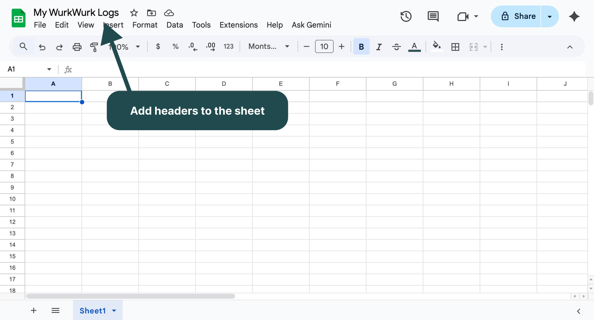
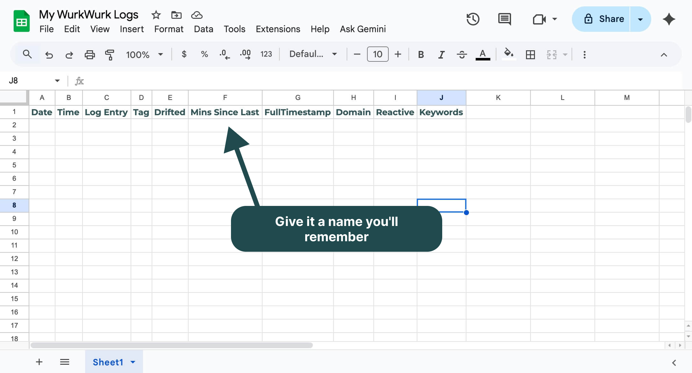
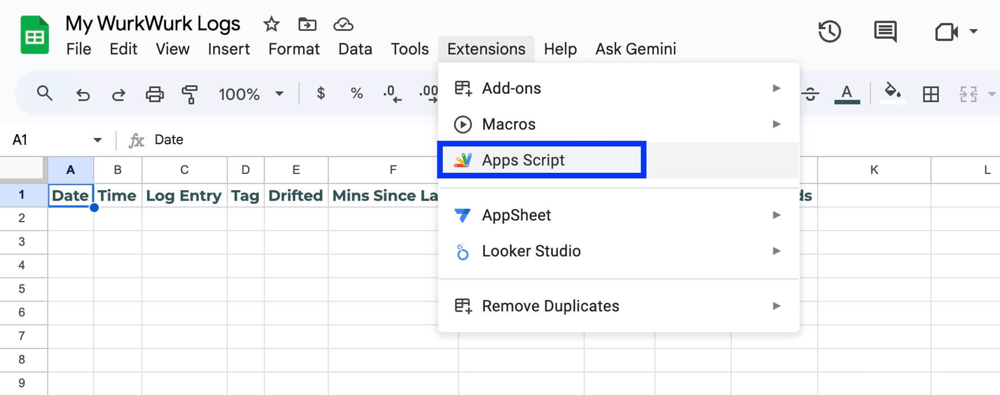
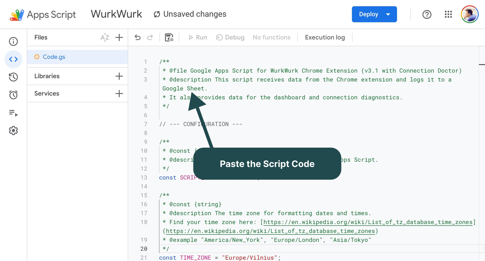
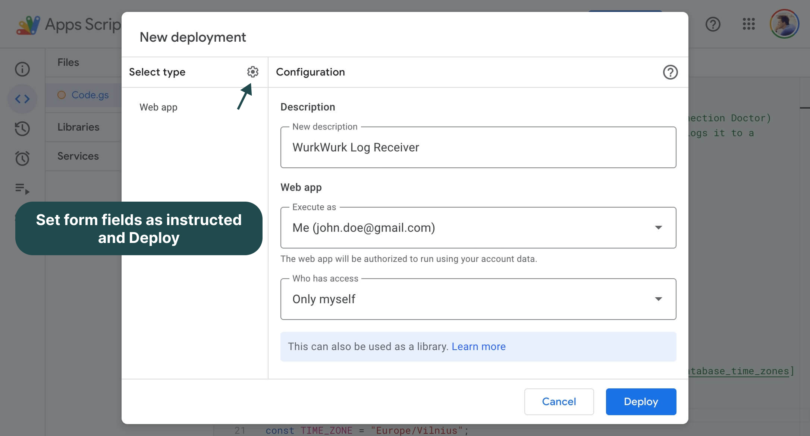
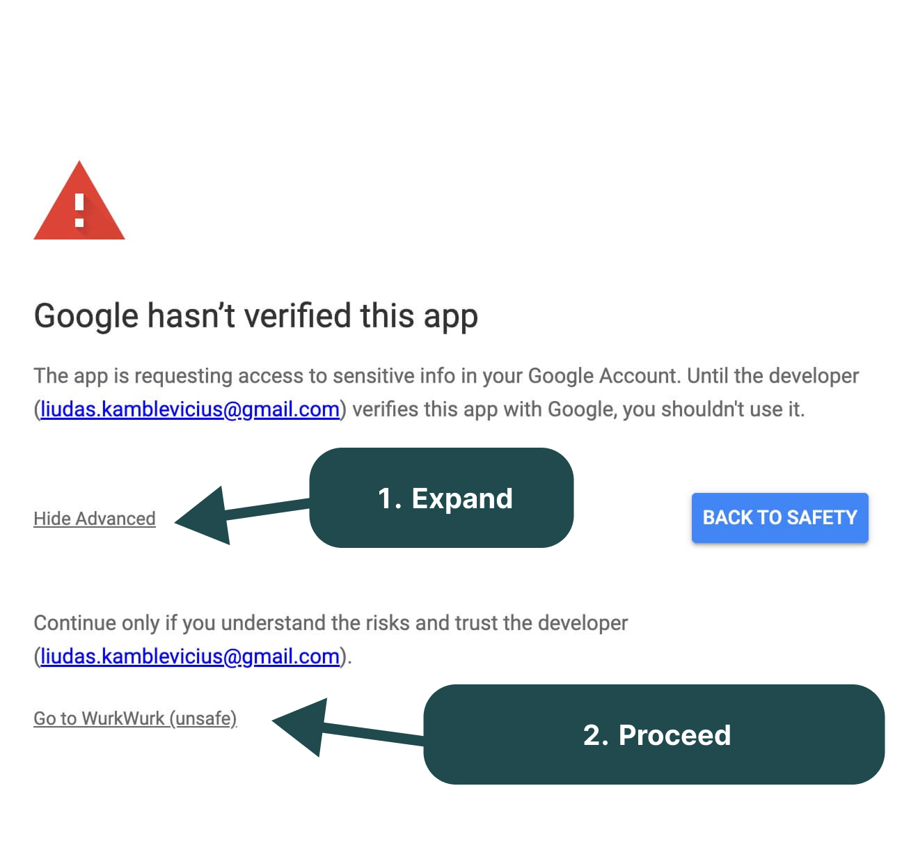
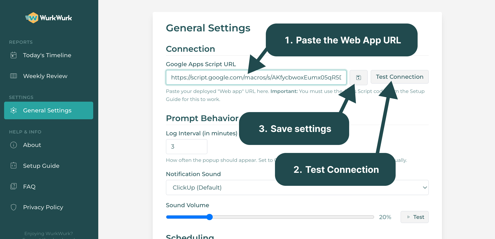

# WurkWurk - Detailed Setup Guide

This guide provides step-by-step instructions to connect the WurkWurk Chrome extension to your own private Google Sheet.

## Step 1: Create Your Google Sheet

1.  Go to [sheets.google.com](https://sheets.google.com).
2.  Click on **Blank** to create a new spreadsheet.
3.  Give the spreadsheet a name you'll remember, like "My WurkWurk Logs."

## Step 2: Add Headers to the Sheet

This is a critical step. The script requires ten specific headers in the first row, in this exact order, to function correctly.

<table><tbody><tr><td data-row="1">A</td><td data-row="1">B</td><td data-row="1">C</td><td data-row="1">D</td><td data-row="1">E</td><td data-row="1">F</td><td data-row="1">G</td><td data-row="1">H</td><td data-row="1">I</td><td data-row="1">J</td></tr><tr><td data-row="2">Date</td><td data-row="2">Time</td><td data-row="2">Log Entry</td><td data-row="2">Tag</td><td data-row="2">Drifted</td><td data-row="2">Mins Since Last</td><td data-row="2">FullTimestamp</td><td data-row="2">Domain</td><td data-row="2">Reactive</td><td data-row="2">Keywords</td></tr></tbody></table>

1.  In cell **A1**, type: `Date`
2.  In cell **B1**, type: `Time`
3.  In cell **C1**, type: `Log Entry`
4.  In cell **D1**, type: `Tag`
5.  In cell **E1**, type: `Drifted`
6.  In cell **F1**, type: `Mins Since Last`
7.  In cell **G1**, type: `FullTimestamp`
8.  In cell **H1**, type: `Domain`
9.  In cell **I1**, type: `Reactive`
10.  In cell **J1**, type: `Keywords`

## Step 3: Create the Google Apps Script

This script will act as the secure bridge between the Chrome extension and your Google Sheet.

1.  In your Google Sheet, click **Extensions** > **Apps Script**.
2.  A new browser tab will open with the Apps Script editor.

## Step 4: Paste the Script Code

1.  Delete any placeholder code in the `Code.gs` file (e.g., `function myFunction() { ... }`).
2.  Copy the entire script from the `app-script.md` file (located in the root of the repository) and paste it into the empty `Code.gs` editor.
3.  **IMPORTANT:** Once pasted, find the line `const TIME_ZONE = "Europe/Vilnius";` and change the time zone to your own if it's incorrect (e.g., `"America/New_York"`).
4.  Save the script by clicking the floppy disk icon or pressing `Ctrl+S`.

## Step 5: Deploy the Script as a Web App

This step creates the secret URL the extension will use to send data to your sheet.

***IF YOU ARE UPDATING FROM A PREVIOUS VERSION, YOU MUST RE-DEPLOY TO APPLY THE CHANGES.***

1.  In the Apps Script editor, click the blue **Deploy** button in the top-right corner.
2.  Select **New deployment**. (If you are re-deploying, select 'Manage Deployments', choose your deployment, and click the pencil icon to edit it. Set the version to 'New version'.)
3.  Click the gear icon (⚙️) next to "Select type" and choose **Web app**.
4.  In the dialog box, enter the following settings:
5.  **Description:** `WurkWurk Log Receiver` (Optional)
6.  **Execute as:** `Me` (This is very important).
7.  **Who has access:** `Only myself` (This does NOT make your sheet public. It only allows someone with the secret, complex URL to send data to the script).
8.  Click **Deploy**.

## Step 6: Authorize the Script

1.  Google will prompt you to authorize the script. Click **Authorize access**.
2.  Choose your Google account.
3.  You will likely see a "Google hasn't verified this app" warning. This is normal for personal scripts. Click **Advanced**, then click "Go to
4.  $$Your Script Name$$
5.  (unsafe)".
6.  Click **Allow** to grant the script permission to edit your spreadsheets.

## Step 7: Copy the Web App URL

After deployment is complete, a dialog box will appear with the **Web app URL**.

**COPY THIS URL.** You will need it for the final step.

## Step 8: Configure the Extension

1.  Go to your Chrome extensions page by navigating to `chrome://extensions`.
2.  Find the "WurkWurk" extension.
3.  Right-click the extension's icon in your Chrome toolbar and click **Options**.
4.  On the settings page:
5.  Paste the **Web app URL** you copied into the first field, "Google Apps Script URL."
6.  Click the **Test** button next to it. You should see a green "Success!" message. If not, double-check your script deployment and URL.
7.  Configure your other preferences, such as the log interval and notification sound.
8.  Scroll to the bottom and click **Save Settings**.

You are all set! The extension is now fully configured and will start prompting you at your chosen interval during your working hours.